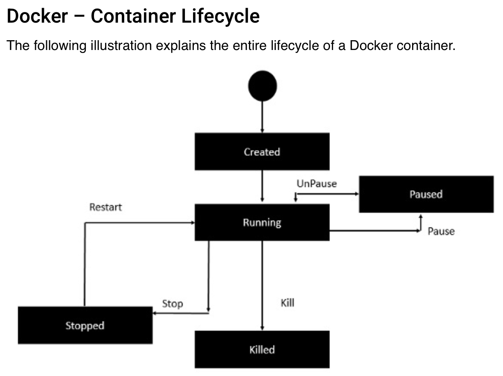

```
$ docker --version
$ docker version
```
Remember, create image from "Dockerfile" 
```
$ docker build -t hello-world:1.0 .
```
with the doc '.', because path of "Dockerfile", now current directory.

```$ docker images
$ docker run hello-world:1.0
$ docker ps
$ docker ps -a
```

Detach mode with '-d' option ```$ docker run -d hello-world:2.0```

Interactive mode with '-it' option ```docker run -it hello-world:2.0```
exit exe terminal on mac with ctr + c.

Different between 'run' = create container from image, and 'start' = container in stop


```
$ docker logs 7bce174fde8b
$ docker stats [ idContainer ]

$ docker start [ idContainer ]
$ docker stop [ idContainer ]
$ docler pause [ idContainer ]
$ docker unpause [ idContainer ]
$ docker kill [ idContainer ]
```


### PULL OWN PROJECT TO DOCKER HUB
```
docker pull [ idUser/idProject ]
```


Now complex app, with independent database container,
for example, with postgreSQL.
https://hub.docker.com/_/postgres

```
$ docker pull postgres
```
Now we have our database Image,
Afterwards, we're going to create our database container
with our name ( app-db ) and detach mode ( -d )
```
docker run --name app-db -d
```